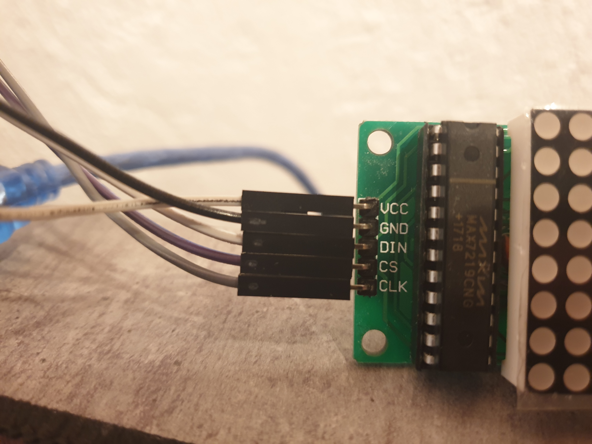
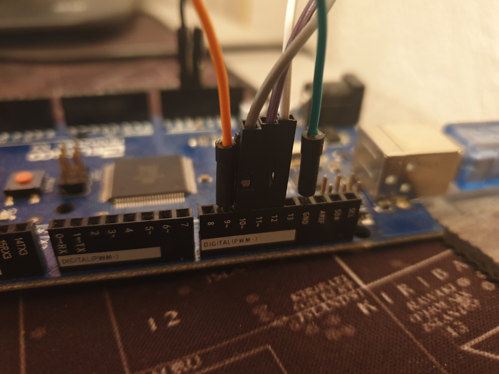
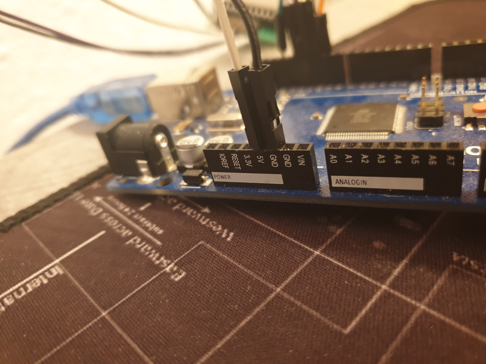
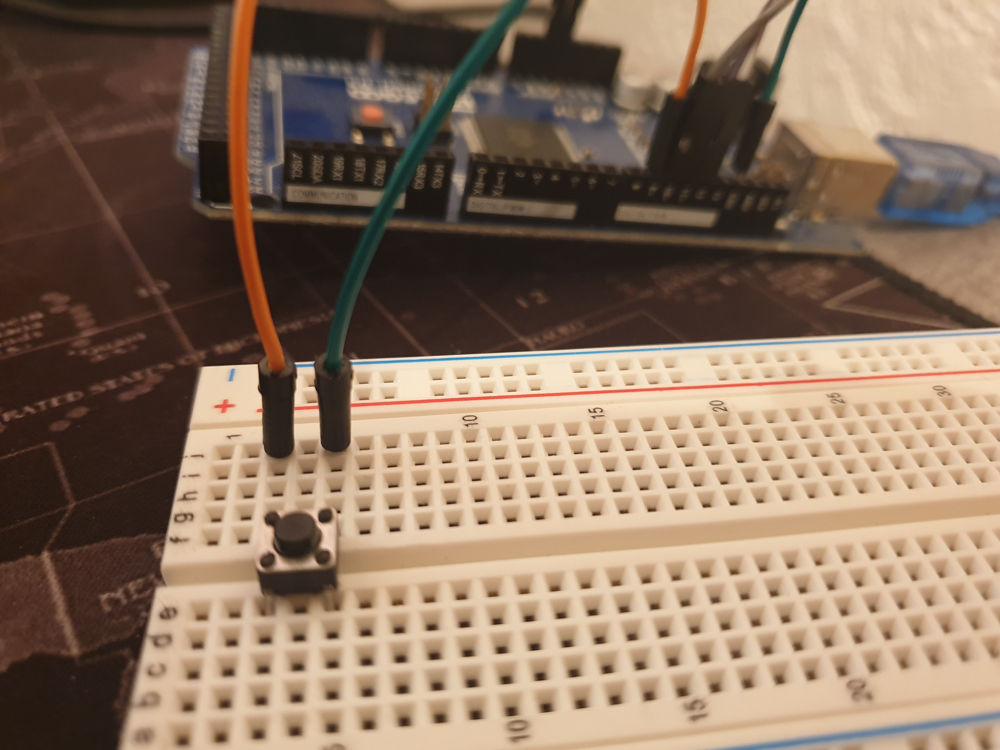

# LedArt
This is a Arduino Project which displays animations on a 8x8 LED Matrix. The animations can be switched by presssing a button.

Click the following link, to watch a demo of the project on YouTube:

# Hardware
**Processor**: Mega 2560 R3  
**Led Matrix**: MAX7219  
**Library-Version**: 1.0.6  

# Connections
## LED Matrix
**VCC** -> 5V  
**GND** -> GND  
**DIN** -> 12  
**CS** -> 11  
**CLK** -> 10  

## Button
Pin 9 and Ground

